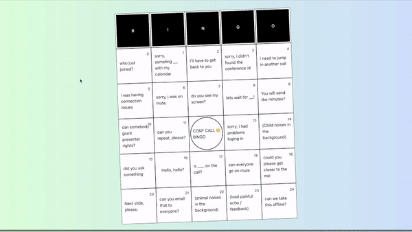

# Bingo Game - Typescript

The game developed for SensoryMind (compnay). In order to, show coding skills.

Created the project using Typescript. 

Wrote unit tests for the project components using Jest and Enzyme libraries.

Used the Tailwind, in order to, create responsive designs. I used Tailwind because it is really easy to use and it increases the readability of the codes.

Also added Webpack and Babel, in order to increase the appliction performance.

Added Eslint, and Prettier. Also, added Husky in order to prevent pushing badly formatted codes.

Also Dockerized all applications.

## Table of Contents
- [Project Overview](#projectoverview)
- [Installation](#installation)
- [Test](#test)
- [Structure](#structure)
- [Support](#support)
- [Contributing](#contributing)


### ProjectOverview
A short overview of the project



## Installation
### with Docker
```sh
git clone https://github.com/mJiyan/bingo-game-typescript.git
cd bingo-game-typescript
docker-compose up
```

### manually
```sh
git clone https://github.com/mJiyan/bingo-game-typescript.git
cd bingo-game-typescript
yarn
yarn start
```


## Test
```sh
git clone https://github.com/mJiyan/bingo-game-typescript.git
cd bingo-game-typescript
yarn
yarn test
```

## Structure
```
├─ __test__
│  ├─ Components
│  │  └─ App.test.js
│  └─  setup
├─ .huksy
│  ├─ pre-commit
│  └─ pre-push
├─ public
│  └─ index.html
│
├─ src
│  │
│  ├─ assets
│  │  └─ styles
│  │     └─ tailwind.css
│  │
│  ├─ Components
│  │  └─ Bingo
│  │     └─ index.tsx
│  │  
│  ├─ Components
│  │  └─ Bingo
│  │     └─ index.tsx
│  │
│  ├─ fake-data
│  │  └─ data.ts
│  │     
│  │
│  ├─ App.tsx
│  └─ index.tsx
│
├─ .eslintrc
├─ .gitignore
├─ .prettierrc
├─ assetsTransformer.js
├─ babel.config.js
├─ docker-compose.yaml
├─ Dockerfile
├─ jest.config.js
├─ postcss.config.js
├─ tailwind.config.js
├─ tsconfig.json
├─ LICENSE
└─ package.json
└─ webpack.config.js
```


## Support

Please [open an issue](https://github.com/mJiyan/bingo-game-typescript/issues) for support & suggestions.

## Contributing

Please contribute using [Github Flow](https://guides.github.com/introduction/flow/). Create a branch, add commits, and [open a pull request](https://github.com/mJiyan/bingo-game-typescript/compare).